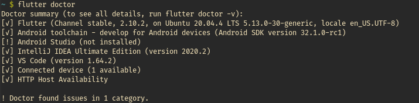

# Mobile Homework

<!-- TABLE OF CONTENTS -->

  
Table of Contents

  <ol>
    <li>
      <a href="#week-1">Week 1</a>
      <ul>
        <li><a href="#lesson-1">Lesson 1</a></li>
        <li><a href="#lesson-2">Lesson 2</a></li>
        <li><a href="#lesson-3">Lesson 3</a></li>
        <li><a href="#lesson-3">Lesson 4</a></li>
        <li><a href="#lesson-3">Lesson 5</a></li>
        <li><a href="#lesson-3">Lesson 6</a></li>
      </ul>
      <a href="#week-1">Week 2</a>
      <ul>
        <li><a href="#lesson-7">Lesson 7</a></li>
        <li><a href="#lesson-8">Lesson 8</a></li>
        <li><a href="#lesson-9">Lesson 9</a></li>
      </ul>
    </li>
  </ol>

## Week 1
#### Lesson 1
- Giới thiệu các tính năng, điểm mạnh của Flutter.
#### Lesson 2
- Cài đặt Flutter và môi trường phát triển.

#### Lesson 3
- Ứng dụng Hello World:

  
#### Lesson 4
- Mọi thứ trong Flutter đều là widget, widget là thành giao diện cơ bản nhất tạo nên toàn bộ giao diện của ứng dụng.
- Các tính năng tương tác sẽ đước tích hợp bất cứ khi nào nhờ GestureDetector widget.
- Trạng thái của các widget được quản lý cập nhật bởi StatefulWidget widget.
- Flutter cung cấp thiết kế class để bất kỳ lớp nào có thể được lập trình tùy thuộc vào độ phức tạp của tác vụ.
#### Lesson 5
- Dart là một ngôn ngữ lập trình mã nguồn mở, đa năng và được phát triển bởi Google.
- Là ngôn ngữ lập trình hướng đối tượng và sử dụng cú phát của C (C-style syntax)
#### Lesson 6
- Trong Flutter, widget được phân loại dựa trên chức năng thành 4 nhóm:
  - Platform widgets: Các widget giao diện đặc thù theo từng nền tảng.
  - Layout widgets: Các widget hỗ trợ bố trí giao diện
  - State maintenance widgets: Các widget quản lý trạng thái
  - Platform independent / basic widgets: Các widget cơ bản độc lập với nền tảng
- Demo:

  

## Week 2
#### Lesson 7
- Có hai loại widget layout chính:
  - Single Child Widgets - Chỉ có một widget con
  - Multiple Child Widgets - Có nhiều widget con
- Demo:

  
#### Lesson 8
- Hỗ trợ một số cử chỉ: Tap, Double Tap, Drag, Flick, Pinch, Spread/Zoom, Panning
- Flutter cung cấp widget GestureDetector để xử lý tất cả các cử chỉ.
- Flutter cũng cung cấp một cơ chế phát hiện cử chỉ cấp thấp thông qua Listener widget
- Flutter còn cung cấp một số nhỏ các widget để thực hiện các cử chỉ cụ thể đơn giản cũng như phức tạp
- Demo:

  
#### Lesson 9
- Quản lý sate (trạng thái) của ứng dụng là một trong những bước quan trọng và cần thiết trong vòng đời của một ứng dụng.
- Việc quản lý trạng thái có thể chia làm hai loại:
  - Ephemeral (ngắn hạn): Kéo dài trong thời gian ngắn. Flutter hỗ trợ quản lý trạng thái loại này thông qua StatefulWidget.
  - App state (trạng thái ứng dụng): Kèo dài trong toàn bộ ứng dụng. Flutter hỗ trợ quản lý trạng thái loại này thông qua scoped_model
#### Lession 10
- Widget được kết thừa từ Statefulwidget để duy trì trạng thái và quản lý các trạng thái con của nó.
- Demo:

  